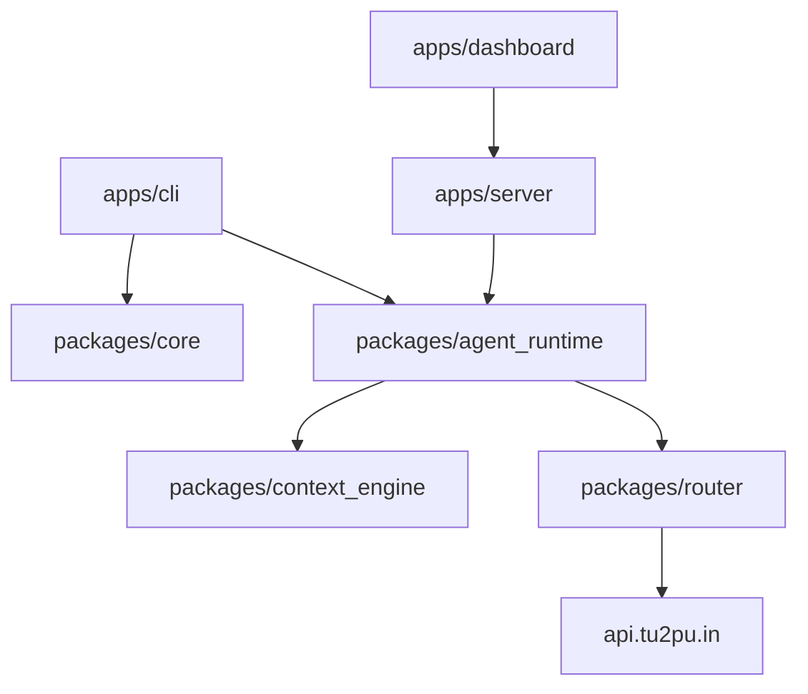

# tu2pu Architectural Overview

This document describes the high-level architecture of the **tu2pu** system.

---

## System Overview

tu2pu is structured as a monorepo containing multiple decoupled packages and application runners. It separates CLI interactions, dashboard UIs, local execution servers, and backend LLM router/orchestration layers.

---

## 1. Client Applications (`apps/`)

* **`apps/cli`**: The primary user-facing terminal interface. Implements the interactive terminal session REPL (in `interactive.ts`), Command mapping definitions, and diagnostic doctor utilities.
* **`apps/dashboard`**: A React-based web interface showing interactive terminal sessions, agent flows, code structures, and model outputs.
* **`apps/server`**: An Express/Fastify-based local service that acts as a bridge between the dashboard frontend and the local state database.

---

## 2. Core Packages (`packages/`)

* **`packages/core`**: Common modules, state transition definitions, base interfaces, and SQLite schemas.
* **`packages/context_engine`**: The workspace scanning and prompt assembly pipeline. It scans active directories, prioritizes files, compresses context, and creates structured developer prompt budgets.
* **`packages/agent_runtime`**: Coordinates turns and executes model calls using custom prompt templates.
* **`packages/router`**: Manages model providers, routing choices, key verifications, and streams completions through `https://api.tu2pu.in`.
* **`packages/cloudflare_manager`**: Handles zero-config deployment of built apps using Wrangler.

---

## 3. Dependency Validator (`scripts/`)

To prevent circular imports and architectural decay, the repository includes a dependency validator:
- **`scripts/validate_architecture.ts`**: Analyzes imports across the packages to ensure strict layer isolation (e.g. core package must never import from higher-level services). Runs as part of our automated build validation checks.
